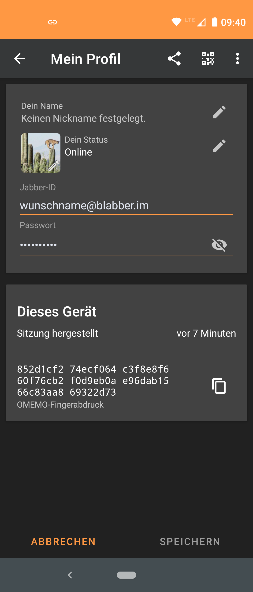
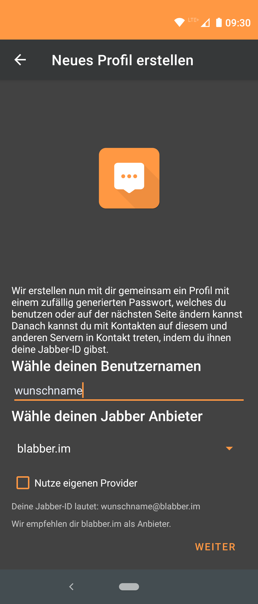
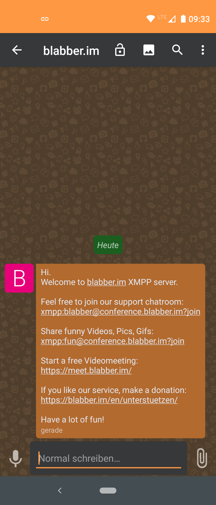
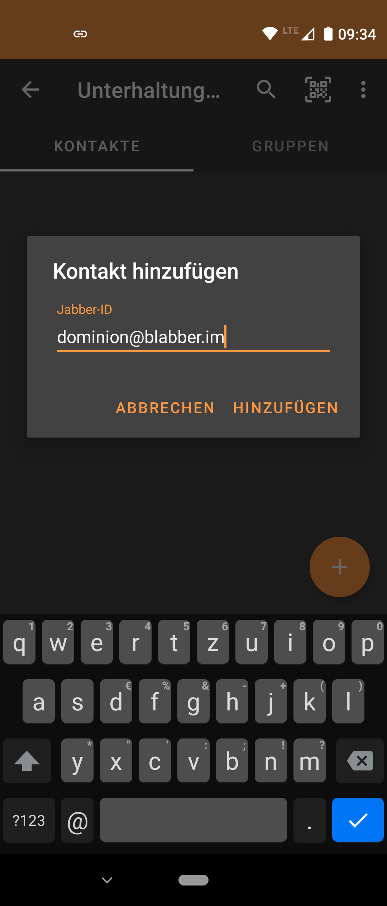
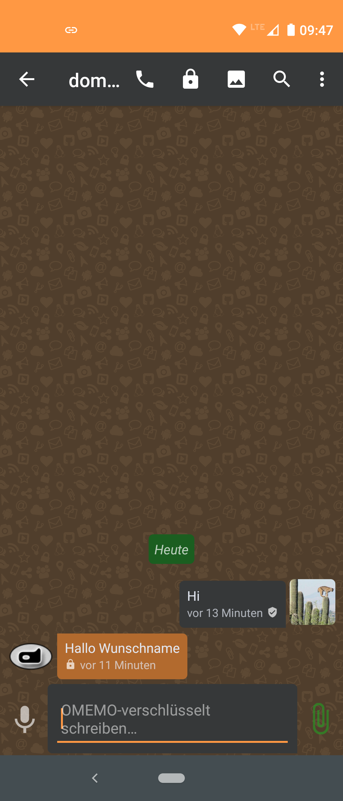
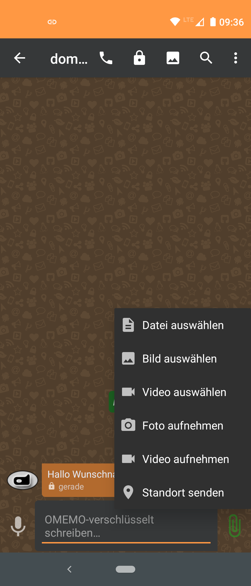
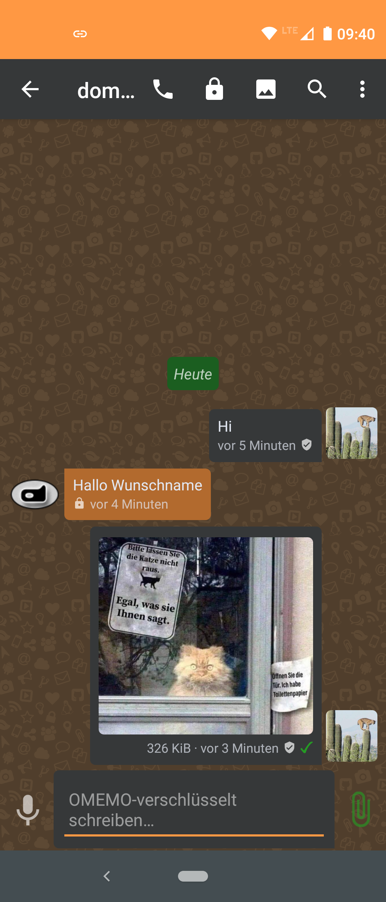

# Ankündigung:

## Aus Pix-Art Messenger wird blabber.im

Die Zusammenarbeit der beiden Projekte blabber.im und Pix-Art Messenger wird im November 2020 weiter ausgebaut.

Bisher war blabber.im nur der Standardserver im Pix-Art Messenger.
Zukünftig wird die Android App Pix-Art Messenger unter dem Namen blabber.im weitergeführt.

Was euch erwartet:
- Funktionsumfang bleibt erhalten
- Support Chaträume werden zusammengelegt
- Farben und Logos werden an blabber.im angepasst
- App ist weiterhin kostenlos im Google Play Store und F-Droid Store verfügbar

Euer blabber.im Team

-----


# Pix-Art Messenger [](https://circleci.com/gh/kriztan/Pix-Art-Messenger/tree/master)

🇬🇧🇺🇸… [English Readme version available here](README-en.md)

blabber.im ist eine Kopie der offiziellen Android-App [Conversations](https://github.com/siacs/Conversations) mit einigen Änderungen, insbesondere zur Verbesserung der Benutzerfreundlichkeit, um den Umstieg von oftmals vorinstallierten Messengern zu erleichtern. Die folgenden Bilder geben erste Eindrücke der App:

      

(Bilder wurden über http://freestockgallery.de bezogen)

Download ist hier möglich:

<a href='https://play.google.com/store/apps/details?id=im.blabber.messenger'></a> <a href="https://f-droid.org/app/de.pixart.messenger"></a>

Alternativ kannst du den Messenger auch direkt hier von Codeberg unter [Releases](https://codeberg.org/kriztan/blabber.im/releases/latest) herunterladen.

<a rel="me" href="https://kanoa.de/@blabber">blabber.im bei Mastodon</a> 

#### blabber.im nightly bzw. beta

Scanne den QR-Code und füge es zu deinen F-Droid Quellen hinzu: 


Google-Nutzer können dem Betaprogramm beitreten:
[blabber.im beta](https://play.google.com/apps/testing/im.blabber.messenger)

#### Wie kann ich bei der Übersetzung helfen?
[](https://crowdin.com/project/pix-art-messenger)

Übersetzungen werden bei [crowdin.com](https://crowdin.com/project/pix-art-messenger) geführt. Dort können Übersetzungen erstellt, geändert und ergänzt werden.

[Hier geht's zur Projektseite bei crowdin.com](https://crowdin.com/project/pix-art-messenger/invite?d=75l6j4k6k6k523f4j4m4e473u663d3m4p4t4q4)

#### Ich habe Probleme, was soll ich tun?
Am einfachsten ist es, wenn du unserer Support-Gruppe beitrittst, dort werden deine Probleme mit Sicherheit schnell gelöst. 

Support-Chat: [blabber@conference.blabber.im](https://blabber.im/j/blabber@conference.blabber.im?join)     
[](https://blabber.im/j/blabber@conference.blabber.im?join)

Development-Chat:  [blabber-dev@conference.blabber.im](https://blabber.im/j/blabber-dev@conference.blabber.im?join)     
[](https://blabber.im/j/blabber-dev@conference.blabber.im?join)


Solltest du dort nicht weiter kommen kannst du [hier](https://codeberg.org/kriztan/blabber.im/issues) ein Issue erstellen, in welchem du dein Problem genau beschreibst und welche Schritte erforderlich sind, um zu dem Problem zu gelangen. 

#### Wie erstelle ich Debug- bzw. ADB-Logs?

##### Linux:

1. Installation von ADB
    ###### Debian und Derivate wie Ubuntu / Linux Mint
    ```
    sudo apt-get update
    sudo apt-get install adb
    # For Debian Jessie and older
    # sudo apt-get install android-tools-adb
    ```
    ###### openSUSE 42.2 und 42.3
    ```
    sudo zypper ref
    sudo zypper install android-tools
    ```
    ###### openSUSE Tumbleweed
    hier muss für das benötigte Packet folgende Repo eingebunden werden (z.B. bequem über Yast):
    http://download.opensuse.org/repositories/hardware/openSUSE_Tumbleweed/
    
    alternativ kann auch der `1 Click Installer` benutzt werden:    
    https://software.opensuse.org/package/android-tools
    
2. Navigiere im Terminal mit `cd` in das Verzeichnis deines Vertrauens
3. Folge den Schritten [6] bis [10] unter [Windows]. s.u.
4. Nun kannst du mit der Ausgabe der Debug-Logs beginnen. Nenne die Log-Datei bspw `logcat.txt`:
   ```
   $ adb -d logcat -v time | grep -i blabber.im > logcat.txt
   ```
5. Fahre nun mit den verbliebenen Schritten unter [Windows] ab Schritt [12] fort.

##### Windows:

1. Lade dir die SDK-Plattform-Tools für dein Betriebssystem von Google herunter:
    
    https://developer.android.com/studio/releases/platform-tools.html    
2. Falls noch nicht getan, lade dir die ADB Treiber für dein Betriebssystem von Google herunter, für Windows hier:
    
    https://developer.android.com/studio/run/win-usb.html
3. Entpacke die zip (z.B. nach C:\ADB\)
4. Öffne die Kommandozeile (CMD) mit Start > Ausführen: cmd
5. Wechsele in der Kommandozeile in das Verzeichnis C:\ADB wie folgt 
    ```
    c:
    cd ADB
    ``` 
6. Auf deinem Telefon gehst du in die Einstellungen und suchst nach dem Punkt `Entwickleroptionen`. Sollte dieser bei dir nicht vorhanden sein, musst du diese Optionen erst noch freischalten. Dazu wechselst du in den Einstellungen in den Punkt `über das Telefon` und suchst dort nach `Buildnummer` oder Ähnlichem. Diese Zeile musst Du mindestens 7 mal hintereinander antippen, es sollte dann ein Hinweis eingeblendet werden, der dir bestätigt, dass du nun Entwickler bist.
7. In den `Entwickleroptionen` suchst du nach dem Eintrag `USB-Debugging` und aktivierst ihn.
8. Schließe dein Handy mit dem USB-Kabel an deinen PC an. Die erforderlichen Treiber sollten zumindest in Windows automatisch installiert werden.
9. Wenn alles ohne Fehler geklappt hat, kannst du wieder in die Kommandozeile gehen und testen, ob alles funktioniert. Gib dazu in CMD `adb devices -l` ein, es sollte in etwa sowas bei dir stehen:
    ```
    > adb devices -l
    List of devices attached
    * daemon not running. starting it now on port 5037 *
    * daemon started successfully *
    042111560169500303f4   unauthorized
    ```
10. Falls dein Handy als `unauthorized` markiert wird, sollte am Handy eine Meldung `USB-Debugging zulassen?` kommen, diese mit `OK` bestätigen, sodass bei `adb devices` folgendes dort stehen sollte:
    ```
    > adb devices
    List of devices attached 
    042111560169500303f4    device
    ```   
11. Nun kannst du mit der Ausgabe der Debug-Logs beginnen. Dazu gibst du im CMD folgendes ein und die Ausgabe beginnt in die Datei `logcat.txt` im Verzeichnis `C:\ADB`:
    ```
    > adb -d logcat -v time | FINDSTR blabber.im > logcat.txt
    ``` 
12. Führe nun die Schritte aus, die zum Fehler führen.

13. Nachdem der Fehler reproduziert wurde, kann das Loggen im Terminal mit `Strg+C` beendet werden.

14. Zum Schluss schaue dir die `logcat.txt` an, lösche ggf. persönliche Angaben und sende diese Datei zur Problemlösung mit einer Beschreibung des Fehlers und was man tun muss, um diesen Fehler zu erhalten, an mich. Nutz dafür den Menüpunkt [Issues](https://codeberg.org/kriztan/blabber.im/issues)
